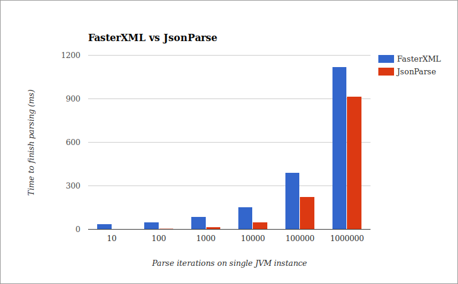

# Json Parse [](https://travis-ci.org/mitchhentges/json-parse)

A tool to quickly parse JSON into Java maps and lists. Consistently faster (sometimes more than 4x) than FasterXML's
Jackson with an extremely small memory footprint.

_Lower is better:_



[Wiki page explaining source of results](https://github.com/mitchhentges/json-parse/wiki/Comparison-with-FasterXML-Jackson)

## Usage

```
String mapString = "{\"fast\":true, \"super-neat\":true}";
String listString = "[1, 2, false]";

Map<String, Object> map = JsonParse.map(mapString);
List<Object> list = JsonParse.list(listString);
```

## Getting the dependency

**Maven**
```
<dependency>
    <groupId>ca.fuzzlesoft</groupId>
    <artifactId>json-parse</artifactId>
    <version>1.2.0</version>
</dependency>
```

**Gradle**
```
compile 'ca.fuzzlesoft:json-parse:1.2.0'
```

## Features

### Throw exceptions with helpful messages with trace to error, e.g. 'a.b.c: "fasle" is an invalid value'
### Thread safe

```
public static void main(String[] args) throws InterruptedException {
    List<Thread> threads = new ArrayList<>();
    for (int i = 0; i < 10; i++) {
        final int id = i;
        Thread thread = new Thread(new Runnable() {
            @Override
            public void run() {
                try {
                    List<Object> ints = JsonParse.list("[1, 2, 3]");
                    System.out.printf("%d: %d,%d,%d\n", id, ints.get(0), ints.get(1), ints.get(2));
                } catch (JsonParseException e) {
                    System.err.println("Exception thrown");
                }
            }
        });
        thread.start();
        threads.add(thread);
    }
    for (int i = 0; i < 10; i++) {
        threads.get(i).join();
    }
}
```

```
0: 1,2,3
9: 1,2,3
8: 1,2,3
7: 1,2,3
5: 1,2,3
6: 1,2,3
1: 1,2,3
3: 1,2,3
2: 1,2,3
4: 1,2,3
```

### Convert a JSON string to a Java `List<Object>`
### Convert a JSON string to a Java `Map<String, Object>`

## FAQ

* Can this convert from JSON directly to `SomeObject`?

Unfortunately not. JSON doesn't have any type information, so explicit knowledge is required before JSON can be
converted. This is the job of a "binding framework"

* Why do my JSON traces show "[]" for array elements, rather than their index?

Since efficiency is a primary goal of this project, array indices could not be added to JSON traces. It would
cost some performance, and that's not worth it ;)

* Why is the code squashed so much?

I wanted to minimize the number of function calls. Though the cost is minimal, it will still affect performance
on the large scale. Besides, my goal is for this to be a "finish and forget" project, where the speed benefits
add up over time, while the maintenance cost is nonexistent because the code "just works". We'll see how naive this
is over time ;)

## License
[MIT License (Expat)](http://www.opensource.org/licenses/mit-license.php)
