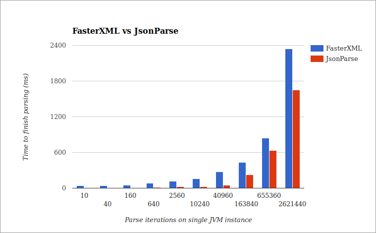

# Json Parse [](https://travis-ci.org/mitchhentges/json-parse)

A tool to quickly parse JSON into Java maps and lists. Significantly faster than FasterXML's
Jackson with an extremely small memory and size footprint.

_Lower is better:_



[Wiki page explaining source of results](https://github.com/mitchhentges/json-parse/wiki/Comparison-with-FasterXML-Jackson)

## Usage

```
String mapString = "{\"fast\":true, \"super-neat\":true}";
String listString = "[1, 2, false]";
String stringString = "\"yo dawg\"";
String numberString = "-1.2e-3";
String boolString = "true";

Map<String, Object> map = JsonParse.map(mapString);
List<Object> list = JsonParse.list(listString);
String string = JsonParse.string(stringString);
Number number = JsonParse.number(numberString);
Boolean bool = JsonParse.bool(boolString);
```

## Getting the dependency

**Maven**
```
<dependency>
    <groupId>ca.fuzzlesoft</groupId>
    <artifactId>json-parse</artifactId>
    <version>1.3.0</version>
</dependency>
```

**Gradle**
```
compile 'ca.fuzzlesoft:json-parse:1.3.0'
```

## Features

### Shows path to syntax error if given invalid JSON

If incorrect JSON is passed to `JsonParse`, the thrown exception will explain _where_ the JSON is invalid.

```
{"outer": {"inner": {"a": true, "b": nulll}}}
outer.inner.b: "nulll" is not a valid constant. Missing quotes?

{"outer": {"inner": {"a": true "b": false}}}
outer.inner.a: wasn't followed by a comma

{"outer": {"no-colon" true}}
outer.no-colon: "no-colon" wasn't followed by a colon

{"object": {no-quotes: true}}
object: unexpected character 'n' where a property name is expected. Missing quotes?

{"outer": {"sick-list": [{}, {"inner": [1, [1, 2, 3, [fasle]]]}]}}
outer.sick-list.[1].inner.[1].[3].[0]: "fasle" is not a valid constant. Missing quotes?
```


### Thread safe

Can be used from multiple thread contexts without losing data integrity or failing.

```
public static void main(String[] args) throws InterruptedException {
    List<Thread> threads = new ArrayList<>();
    for (int i = 0; i < 10; i++) {
        final int id = i;
        Thread thread = new Thread(new Runnable() {
            @Override
            public void run() {
                try {
                    List<Object> ints = JsonParse.list("[1, 2, 3]");
                    System.out.printf("%d: %d,%d,%d\n", id, ints.get(0), ints.get(1), ints.get(2));
                } catch (JsonParseException e) {
                    System.err.println("Exception thrown");
                }
            }
        });
        thread.start();
        threads.add(thread);
    }
    for (int i = 0; i < 10; i++) {
        threads.get(i).join();
    }
}
```

```
0: 1,2,3
9: 1,2,3
8: 1,2,3
7: 1,2,3
5: 1,2,3
6: 1,2,3
1: 1,2,3
3: 1,2,3
2: 1,2,3
4: 1,2,3
```

### Convert JSON strings to a Java objects.


```
// For example, arrays.
String listString = "[1, 2, false]";
List<Object> list = JsonParse.list(listString);
```

## FAQ

* Can this convert from JSON directly to `SomeObject`?

Unfortunately not. JSON doesn't have any type information, so explicit knowledge is required before JSON can be
converted. This is the job of a "binding framework"

* Why is the code squashed so much?

I wanted to minimize the number of function calls. Though the cost is minimal, it will still affect performance
on the large scale. Besides, my goal is for this to be a "finish and forget" project, where the speed benefits
add up over time, while the maintenance cost is nonexistent because the code "just works". We'll see how naive this
is over time ;)

## License
[MIT License (Expat)](http://www.opensource.org/licenses/mit-license.php)
